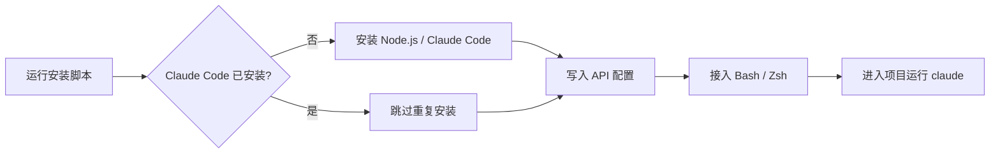

<div align="center">

# 🚀 Claude Code Linux 一键安装器

**在 Linux / WSL 上快速安装 Claude Code，并配置自定义 Anthropic 兼容 API。**

<p>
  
  
  
  
</p>

<p>
  自动安装 · 自定义 Base URL · 双认证模式 · 默认模型 · Auto mode 网关兼容
</p>

</div>

> [!IMPORTANT]
> 本项目不是 Anthropic 官方项目。使用第三方 API 网关前，请确认它兼容 Anthropic Messages API，并充分了解其安全性、隐私政策和计费方式。

## 目录

| 入门 | 配置 | 使用与维护 |
|---|---|---|
| [快速开始](#快速开始) | [认证方式](#认证方式) | [常用操作](#常用操作) |
| [系统要求](#系统要求) | [配置保存位置](#配置保存位置) | [Auto mode](#auto-mode-与第三方网关) |
| [安装方式](#安装方式) | [参数说明](#参数说明) | [常见问题](#常见问题) |

## 功能特性

| 📦 安装与兼容 | 🔐 API 与配置 | 🛠️ 稳定性与维护 |
|---|---|---|
| Linux / WSL | 自定义 `ANTHROPIC_BASE_URL` | 自动跳过重复安装 |
| x86_64 / ARM64 | Token / API Key 双认证 | 规避 npm `EEXIST` |
| npm / 原生安装器 | 自定义默认模型 | 自动修复用户级 PATH |
| Node.js 22+ 自动安装 | 密钥文件权限 `600` | 跳过首次登录引导 |
| 主流 Linux 发行版 | Bash / Zsh 自动接入 | 交互 / 非交互 / dry-run |
| 已安装时自动跳过 | `shell` / `settings` 两种模式 | Auto mode 网关兼容选项 |

### 安装流程



## 快速开始

### 一行交互式安装

```bash
curl -fsSL https://raw.githubusercontent.com/zxfccmm4/claude-code-linux-installer/main/install-claude-code.sh | bash
```

脚本会依次询问：

1. Base URL
2. API Key / Token（输入不会显示）
3. 认证方式
4. 默认模型（可留空）

### 下载后运行

需要查看脚本内容、重复使用或传递参数时，推荐先下载：

```bash
curl -fLo install-claude-code.sh \
  https://raw.githubusercontent.com/zxfccmm4/claude-code-linux-installer/main/install-claude-code.sh
chmod +x install-claude-code.sh
./install-claude-code.sh
```

> [!TIP]
> 不建议把真实 Token 直接写进命令行。命令行参数可能被 shell 历史或系统进程信息记录，优先使用交互输入或环境变量。

## 系统要求

| 项目 | 支持范围 |
|---|---|
| 操作系统 | Linux、WSL |
| CPU | x86_64 / AMD64、ARM64 / AArch64 |
| Shell | Bash；自动写入 Bash / Zsh 配置 |
| npm 安装模式 | Node.js 22 或更高 |
| 原生安装模式 | 不依赖 Node.js |

截至 2026-09-24，Claude Code 官方 npm 包要求 Node.js 22 或更高，因此本脚本不再按旧教程检查 Node.js 18。若不希望安装 Node.js，可以选择原生安装模式。

## 安装方式

### npm 安装（默认）

```bash
./install-claude-code.sh
```

脚本会安装：

```text
@anthropic-ai/claude-code
```

如果已检测到可运行的 `claude` 命令，会跳过重复安装，仅更新配置。

### Anthropic 原生安装器

原生安装模式不需要 Node.js：

```bash
./install-claude-code.sh \
  --install-method native \
  --base-url "https://gateway.example.com" \
  --token "sk-xxxx"
```

## 非交互安装

适用于自动化部署、云服务器初始化和容器环境：

```bash
./install-claude-code.sh \
  --base-url "https://gateway.example.com" \
  --token "sk-xxxx" \
  --auth-mode auth-token \
  --model "MODEL_ID" \
  --non-interactive
```

更安全的方式是通过环境变量传入密钥：

```bash
CLAUDE_BASE_URL="https://gateway.example.com" \
CLAUDE_API_KEY="sk-xxxx" \
CLAUDE_AUTH_MODE="auth-token" \
CLAUDE_MODEL="MODEL_ID" \
./install-claude-code.sh --non-interactive
```

这里的 `CLAUDE_API_KEY` 是安装脚本读取的通用密钥变量；脚本会根据 `CLAUDE_AUTH_MODE` 将它保存为正确的 Claude Code 环境变量。

## 认证方式

| 参数 | 写入的环境变量 | HTTP 认证形式 | 常见场景 |
|---|---|---|---|
| `--auth-mode auth-token` | `ANTHROPIC_AUTH_TOKEN` | `Authorization: Bearer ...` | 代理、中转和兼容网关；默认值 |
| `--auth-mode api-key` | `ANTHROPIC_API_KEY` | `X-Api-Key: ...` | Anthropic 官方 API 或要求 API Key 请求头的服务 |

请以 API 服务商提供的文档为准。仅兼容 OpenAI API 的服务不一定能用于 Claude Code，目标地址需要兼容 Anthropic Messages API。

## 配置保存位置

### Shell 配置（默认）

密钥和 API 配置只保存一份：

```text
~/.config/claude-code/env
```

文件权限会被设置为：

```text
600
```

脚本会在以下文件中加入加载语句，而不是重复保存密钥：

```text
~/.bashrc
~/.bash_profile
~/.zshrc
```

让配置在当前终端立即生效：

```bash
source ~/.config/claude-code/env
hash -r
```

### Claude Code settings.json

如果更希望把环境变量安全合并到 Claude Code 配置中：

```bash
./install-claude-code.sh --config-mode settings
```

目标文件：

```text
~/.claude/settings.json
```

脚本会保留文件中的其他已有字段，不会整文件覆盖。

## 安装后使用

默认的 `shell` 配置模式需要在当前终端加载一次环境文件：

```bash
source ~/.config/claude-code/env
hash -r
cd your-project-folder
claude
```

如果使用了 `--config-mode settings`，无需执行 `source`，直接进入项目运行 `claude`。

验证安装：

```bash
node --version       # 仅 npm 模式要求 v22+
claude --version
claude doctor
```

## 常用操作

### 只更新 API 配置

```bash
./install-claude-code.sh \
  --skip-install \
  --base-url "https://gateway.example.com" \
  --token "sk-new" \
  --auth-mode auth-token \
  --non-interactive
```

### 强制更新或重新安装

```bash
./install-claude-code.sh --force-install
```

如果旧的 Claude Code 入口可能造成冲突，脚本会先备份，再执行安装。

### 更改模型

模型名称必须使用 API 服务商或第三方网关实际支持的模型 ID。

当前 Claude Code 会话中选择模型：

```text
/model
```

单次启动指定模型：

```bash
claude --model MODEL_ID
```

永久修改默认 shell 配置：

```bash
ENV_FILE="${XDG_CONFIG_HOME:-$HOME/.config}/claude-code/env"
sed -i \
  -e '/^export ANTHROPIC_MODEL=/d' \
  -e '/^unset ANTHROPIC_MODEL$/d' \
  "$ENV_FILE"
printf "export ANTHROPIC_MODEL='%s'\n" "MODEL_ID" >> "$ENV_FILE"
source "$ENV_FILE"
```

取消固定模型：

```bash
ENV_FILE="${XDG_CONFIG_HOME:-$HOME/.config}/claude-code/env"
sed -i \
  -e '/^export ANTHROPIC_MODEL=/d' \
  -e '/^unset ANTHROPIC_MODEL$/d' \
  "$ENV_FILE"
printf '%s\n' 'unset ANTHROPIC_MODEL' >> "$ENV_FILE"
source "$ENV_FILE"
```

## Auto mode 与第三方网关

Claude Code 新版 Auto mode 可以由 Anthropic 服务端处理分类器请求。第三方网关如果没有完整透传相关字段，可能出现类似提示：

```text
This session isn't eligible because your requests go through your gateway,
which isn't compatible with this update.
```

这不是安装错误：

- Claude Code 仍可正常使用
- Auto mode 仍会工作
- 分类器请求会继续按原方式处理和计费

如果暂时只想隐藏提示并继续使用原有处理方式，可以写入：

```bash
export CLAUDE_CODE_AUTO_MODE_SERVER=0
```

使用安装脚本配置：

```bash
./install-claude-code.sh \
  --skip-install \
  --base-url "https://gateway.example.com" \
  --token "sk-xxxx" \
  --auth-mode auth-token \
  --auto-mode-server off \
  --non-interactive
```

直接修改默认 shell 配置：

```bash
ENV_FILE="${XDG_CONFIG_HOME:-$HOME/.config}/claude-code/env"
sed -i \
  -e '/^export CLAUDE_CODE_AUTO_MODE_SERVER=/d' \
  -e '/^unset CLAUDE_CODE_AUTO_MODE_SERVER$/d' \
  "$ENV_FILE"
printf '%s\n' 'export CLAUDE_CODE_AUTO_MODE_SERVER=0' >> "$ENV_FILE"
source "$ENV_FILE"
```

网关完成适配后恢复默认行为：

```bash
ENV_FILE="${XDG_CONFIG_HOME:-$HOME/.config}/claude-code/env"
sed -i \
  -e '/^export CLAUDE_CODE_AUTO_MODE_SERVER=/d' \
  -e '/^unset CLAUDE_CODE_AUTO_MODE_SERVER$/d' \
  "$ENV_FILE"
printf '%s\n' 'unset CLAUDE_CODE_AUTO_MODE_SERVER' >> "$ENV_FILE"
unset CLAUDE_CODE_AUTO_MODE_SERVER
```

网关需要完整透传 `safeguards`、`safeguard_results` 和相关工具调用字段。具体要求参见 [Claude Code Auto mode classifier billing](https://code.claude.com/docs/en/auto-mode-classifier-billing)。

## 常见问题

<details>
<summary><strong>❓ claude: command not found</strong></summary>

先执行：

```bash
export PATH="$HOME/.local/bin:$PATH"
source ~/.config/claude-code/env
hash -r
claude --version
```

如果仍然无法找到命令，检查文件是否存在：

```bash
ls -l ~/.local/bin/claude
```

</details>

<details>
<summary><strong>❓ npm 报错 EEXIST</strong></summary>

新版脚本会优先检测已有 Claude Code，并避免重复安装。现有命令可以运行时，直接更新配置：

```bash
./install-claude-code.sh --skip-install
```

确实需要覆盖安装时：

```bash
./install-claude-code.sh --force-install
```

</details>

<details>
<summary><strong>❓ 首次启动仍显示登录方式</strong></summary>

自定义 Base URL 和 Token 时，脚本会把下面的状态安全合并到 `~/.claude.json`：

```json
{
  "hasCompletedOnboarding": true
}
```

原有 JSON 字段会被保留。如果配置是在旧版脚本中生成的，重新运行：

```bash
./install-claude-code.sh --skip-install
```

</details>

<details>
<summary><strong>❓ curl | bash 交互输入异常</strong></summary>

新版脚本会从 `/dev/tty` 读取交互输入，不会把后续脚本源码误读为选项。如果当前环境没有控制终端，请先下载脚本，或者改用 `--non-interactive`。

</details>

<details>
<summary><strong>❓ Base URL 无法使用</strong></summary>

请依次确认：

- 地址以 `http://` 或 `https://` 开头
- URL 中没有空格
- 服务支持 Anthropic Messages API
- 认证方式与网关要求一致
- 模型 ID 确实存在于该网关

</details>

## 参数说明

| 参数 | 说明 | 默认值 |
|---|---|---|
| `--base-url URL` | Anthropic Messages API 兼容地址 | 交互输入 |
| `--api-key KEY` / `--token TOKEN` | API Key 或 Token | 交互输入 |
| `--auth-mode MODE` | `auth-token` 或 `api-key` | `auth-token` |
| `--model MODEL` | 设置 `ANTHROPIC_MODEL` | 留空 |
| `--install-method METHOD` | `npm` 或 `native` | `npm` |
| `--version VERSION` | `latest`、具体版本号；`stable` 仅适用于原生安装 | `latest` |
| `--config-mode MODE` | `shell` 或 `settings` | `shell` |
| `--auto-mode-server MODE` | `auto` 或 `off` | `auto` |
| `--skip-node` | npm 模式下跳过 Node.js 检查与安装 | 关闭 |
| `--skip-install` | 不安装 Claude Code，只更新配置 | 关闭 |
| `--force-install` | 备份可能冲突的旧入口并重新安装 | 关闭 |
| `--non-interactive` | 禁用交互，缺少必要参数时退出 | 关闭 |
| `--dry-run` | 只显示计划操作，不写文件 | 关闭 |
| `-h`, `--help` | 显示脚本帮助 | — |

查看完整帮助：

```bash
./install-claude-code.sh --help
```

## Dry-run

在真正修改系统前预览操作：

```bash
./install-claude-code.sh \
  --base-url "https://gateway.example.com" \
  --token "test-token" \
  --dry-run \
  --non-interactive
```

## 安全建议

> [!CAUTION]
> `~/.config/claude-code/env` 和 `~/.claude/settings.json` 可能包含敏感凭据，请勿公开上传或分享。

- 生产环境只使用 HTTPS Base URL
- 不要把真实 Token 提交到 Git、脚本、截图或聊天记录
- 优先通过交互输入、环境变量或秘密管理器传递 Token
- 第三方网关可以看到请求内容和密钥，只使用可信服务
- 定期轮换 API Token，并及时撤销泄露的凭据

## 许可证

本项目当前未附带开源许可证。未经许可，请勿将代码重新打包后冒充官方安装器发布。

---

<div align="center">

如果这个项目对你有帮助，欢迎在 GitHub 上点一个 ⭐

</div>
